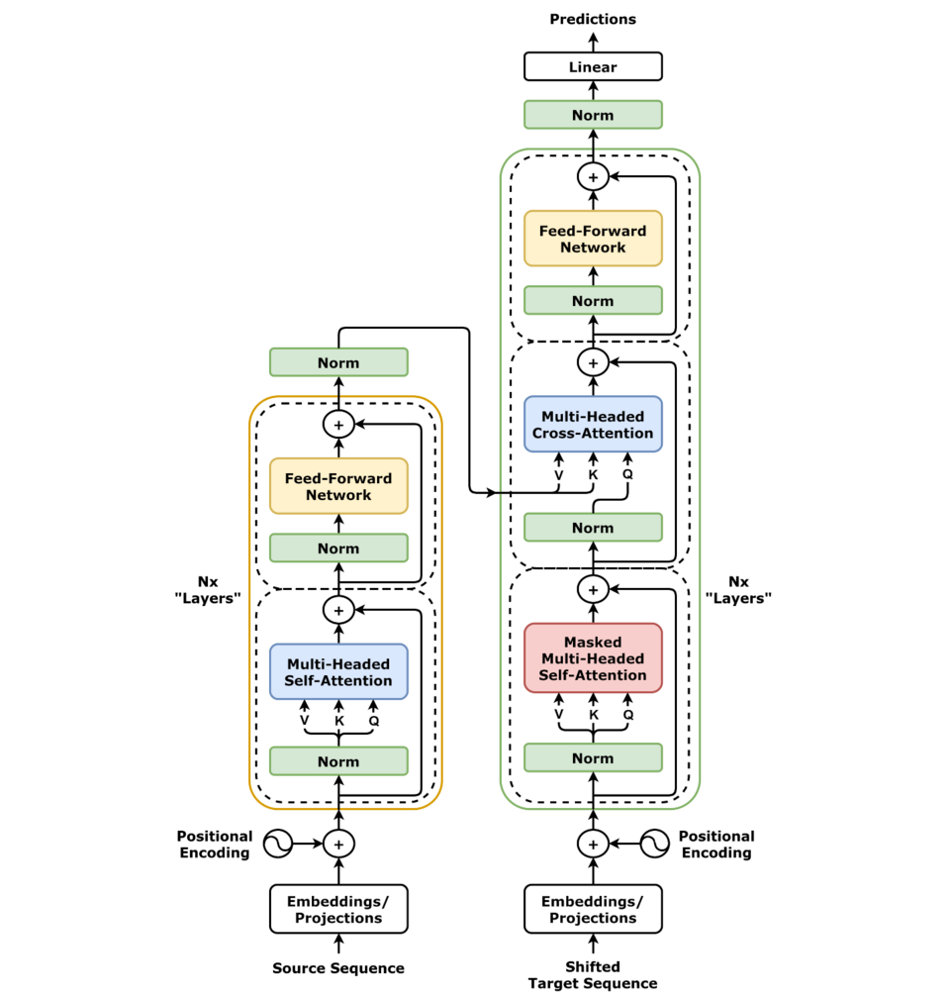

# Transformer 및 대규모 언어 모델 아키텍처: 설계 원리와 구현

`StudyLLM`은 **Transformer 디코더 아키텍처**를 순수 C로 구현한 **LLM 추론 엔진**입니다.

현재 저장소는 다음 단계에 해당합니다.

- `엔진 유형`: decoder-only Transformer의 핵심 forward path를 구현한 경량 추론 엔진
- `현재 단계`: 1개 디코더 블록 기준의 미니 추론 엔진 단계
- `구현 범위`: positional encoding, layer normalization, multi-head attention, FFN, residual 연결, 외부 가중치 로드, 단일 블록 forward
- `아직 미구현`: 토크나이저/BPE, output projection 기반 실제 logits 계산, softmax sampling, autoregressive decoding loop, KV-cache, 다층 스택 확장, GGUF 완전 호환

이 저장소는 두 가지 축으로 구성되어 있습니다.

- Transformer와 LLM 아키텍처를 이론 중심으로 정리한 문서
- 핵심 계산 흐름을 따라가며 구조를 익힐 수 있도록 만든 순수 C 기반 LLM 추론 엔진 `llm-c`

처음 보는 경우에는 아래 순서로 읽는 것이 가장 빠릅니다.

1. 이 README에서 Transformer/LLM의 큰 흐름 파악
2. `llm-c/`에서 실제 C 구현 확인
3. `llm-c.md`에서 모듈별 수식-코드 매핑과 빌드 흐름 확인

## 빠른 시작

현재 구현된 미니 추론 엔진을 바로 실행해보려면 아래 명령으로 충분합니다.

```bash
cd llm-c
chmod +x build.sh
./build.sh
```

실행이 끝나면 `build/demo`는 토큰별 출력 벡터를, `build/hello_min`은 규칙 기반 `"Hello, world!"` 데모를 출력합니다.

## 저장소 구성

- `README.md`: Transformer와 최신 LLM 아키텍처의 배경, 핵심 개념, 발전 방향 정리
- `llm-c/`: Transformer 디코더의 핵심 추론 경로를 직접 구현한 순수 C 엔진 코드
- `llm-c.md`: `llm-c` 세부 구조, 가중치 생성 파이프라인, 모듈별 설명
- `LLM.png`, `디코더.png`: 이해를 돕는 구조도


## 서론
최근 인공지능 분야에서는 대규모 언어 모델(Large Language Model, LLM)을 비롯한 거대 매개변수 모델들의 발전이 혁신적인 성과를 보이고 있다.   
수백억에서 수천억 개의 매개변수를 가진 LLM들은 방대한 말뭉치로 사전 학습되어 텍스트 생성, 질의 응답, 코드 생성 등 다양한 작업에서 인간 수준에 가까운 성능을 보여주고 있다.  
  
 2022년 공개된 ChatGPT는 사용자 질의에 유창하고 일관된 답변을 생성함으로써 전 세계적인 관심을 불러일으켰고, 이를 계기로 OpenAI, Google, Meta 등의 기업들이 경쟁적으로 초거대 언어 모델 개발에 투자하기 시작했다.  
생성 AI 붐 속에서, Meta가 공개한 LLaMA 모델과 DeepSeek 등이 대표적인 오픈소스 LLM으로 부상하였다.  
예를 들어, 중국의 AI 스타트업 DeepSeek는 2025년 자사 모델 DeepSeek-R1을 공개하여 미국 앱스토어 무료 앱 1위를 달성하고 ChatGPT의 인기를 뛰어넘는 등 큰 반향을 일으켰다.  
DeepSeek의 공개로 인해 엔비디아(NVIDIA)의 주가가 단기간 17% 하락했다는 보고도 있으며, 이는 개방형 LLM의 등장이 산업계에 미치는 파급력을 보여준다.

#### 이러한 대규모 AI 모델의 성공 이면에는 Transformer 아키텍처의 혁신적인 등장이 있었다.  
2017년 Vaswani 등이 제안한 Transformer 모델은 이전까지 주로 사용되던 순환신경망(RNN)의 한계를 뛰어넘어, 셀프-어텐션(self-attention) 메커니즘을 통해 시퀀스 내 모든 단어 쌍 간의 상호작용을 한 번에 모델링할 수 있게 했다.  
RNN 계열이 갖고 있던 장기 의존성 학습의 어려움(예: 장기간 시퀀스에서 기울기 소실 문제)을 해결하기 위해, Transformer는 각 토큰이 전체 입력 문맥의 어떤 토큰에 주목해야 하는지를 학습하는 어텐션 기법을 도입하였다.  
그 결과, 멀리 떨어진 단어들 간의 관계까지 효율적으로 포착할 수 있게 되었고, 복잡한 패턴 학습 능력이 크게 향상되었다.

Transformer는 순환 구조가 없기 때문에 병렬 연산이 가능해 학습 속도 면에서도 RNN보다 유리하며, 이러한 이점들로 인해 현재 거의 모든 최신 LLM의 기본 토대가 되고 있다.  
사실상 “대규모 언어 모델 = Transformer의 확장판”이라고 해도 과언이 아닐 정도로, GPT 시리즈와 BERT 등 현대 NLP의 핵심 모델들은 모두 Transformer에 기반하고 있다.

#### 본 글에서는 Transformer와 LLM 아키텍처의 근간을 이루는 설계 철학과 기술적 발전을 체계적으로 정리한다.  
먼저 관련 연구 및 배경으로서 다양한 AI 시스템에서의 아키텍처 설계와 LLM으로의 패러다임 전환을 살펴본다.  
이후 Transformer 모델의 내부 구조를 집중적으로 설명하고, 핵심 구성요소인 다중-헤드 어텐션과 피드포워드 네트워크 등을 분석한다.  
또한 오픈소스 구현 예시로서 간단한 C 구현을 통해 Transformer 블록의 동작을 살펴보고, Meta의 llama.cpp와 같은 최적화된 LLM 엔진이 어떻게 동작하는지도 언급한다.  
  
마지막으로 DeepSeek 모델을 비롯한 최신 LLM에서 도입된 새로운 기법들 – 예를 들어 Multi-head Latent Attention, Mixture-of-Experts, Multi-Token Prediction, Group Relative Policy Optimization 등 – 을 소개하고, 이러한 기술 혁신이 대규모 모델의 성능 및 효율 향상에 가져온 영향과 향후 전망을 논의한다.  
  
본 문서는 대규모 언어 모델의 기반이 되는 아키텍처 원리부터 실제 구현에 이르는 과정을 폭넓게 다룬다.

---
## 관련 연구

아키텍처 설계는 인공지능 시스템 전반에 걸쳐 성능과 특성을 결정하는 핵심 요소입니다.  
예를 들어 자율주행 및 첨단 운전자 보조 시스템(ADAS) 분야에서는 차량의 여러 서브시스템을 통합적으로 제어하기 위한 계층적 제어 아키텍처가 연구되었습니다.  
Lin 등은 조향 및 제동과 같은 개별 기능들을 조정하여 차량의 거동을 관리하는 모션 관리 통합 아키텍처를 제안하였는데, 이를 통해 기존에 각각 작동하던 시스템 간 협조를 향상시켜 주행 경로 추종 오차를 줄일 수 있음을 보였습니다.  
이러한 협조 제어 아키텍처는 차량 시스템을 “시스템들의 시스템”으로 간주하여, 복잡한 기능들을 모듈화하고 상위 계층에서 조율함으로써 성능 개선을 달성합니다.

한편 휴먼-스웜 상호작용 분야에서는 투명성(Transparency)과 신뢰를 향상시키기 위한 아키텍처 개념이 제시되었습니다.  
Hepworth 등은 인간과 로봇 군집(swarm)이 협업할 때 설명 가능성(Explicability), 해석 가능성(Interpretability), 예측 가능성(Predictability)을 체계적으로 구현하기 위한 HST³ 아키텍처를 제안하였습니다.  
이 아키텍처는 투명성을 상위 개념으로 정의하고, 그 하위에 해석·설명·예측 가능성의 틀을 두어 인간-에이전트 팀의 상황 인식과 신뢰 형성을 도모합니다.  
이는 단순한 성능 향상을 넘어, AI 시스템의 이해력과 신뢰성을 구조적으로 높이려는 노력의 일환이라 할 수 있습니다.

이처럼 시스템 아키텍처는 자율주행 차량부터 인간-AI 협업에 이르기까지 다양한 맥락에서 중요합니다.  
딥러닝 모델 아키텍처 역시 지난 수십 년간 큰 변화를 겪어왔습니다.   

과거에는 순환 신경망(RNN)과 LSTM 같은 구조가 시퀀스 모델링의 주류였으나, 심층 RNN은 긴 시퀀스에서 장기 의존성 학습에 어려움이 있었습니다.  
이를 극복한 Transformer의 등장은 딥러닝 패러다임의 전환점이 되었고, 이후 사전 학습 언어 모델의 시대를 열었습니다.  
2018년 등장한 BERT(Bidirectional Encoder Representations from Transformers)와 GPT(Generative Pre-trained Transformer)는 방대한 비지도 데이터로 사전 학습한 후 다운스트림 과제를 미세조정(fine-tuning)하는 접근으로 거의 모든 NLP 문제의 성능 지평을 끌어올렸습니다.  
특히 GPT 계열 모델은 디코더 기반 Transformer를 활용하여 대용량 텍스트를 생성하는데 특화되었고, BERT는 인코더 기반 Transformer로 문장의 이해 및 분석에 주로 사용되었습니다.  
이들 파운데이션 모델의 성공으로, 대규모 사전 학습→미세조정이라는 표준 기술 루틴이 정착되었습니다.

#### 대규모 언어 모델(LLM)은 이러한 사전 학습 Transformer 모델을 극한까지 확장한 형태입니다.  
파라미터 수가 수십억→수백억→수천억으로 기하급수적으로 증가함에 따라 모델의 표현력도 크게 향상되었지만, 이에 비례하여 데이터 및 연산 자원의 필요량도 폭증하였습니다.  
최신 LLM의 학습은 수천 개의 GPU/TPU로 구성된 분산 시스템에서 수행되며, 하나의 모델을 학습하는데 수백만 달러에 달하는 비용이 소요되기도 합니다.  
또한 모델 용량의 증가와 함께, 단순한 확률적 언어 모델을 넘어 사용자 의도에 따라 응답을 조율하는 기법이 중요해졌습니다.  
OpenAI는 GPT-3 이후 인간 피드백을 통한 강화학습(RLHF)을 도입하여 모델의 응답이 보다 유용하고 안전하도록 훈련시켰습니다.  
RLHF는 인간 평가자가 선호하는 출력을 보상으로 주는 정책 최적화로, 기존의 언어 모델을 대화형 비서로 탈바꿈시킨 핵심 기술입니다.  
다만 표준 RLHF에서는 Proximal Policy Optimization(PPO) 알고리즘이 사용되고 보상함수에 KL 벌점을 추가하는 등 복잡한 설계가 들어갑니다.

#### 오픈소스 LLM의 부상도 주목할 만한 동향입니다.  
2023년 Meta가 공개한 LLaMA는 연구 목적의 모델 가중치를 공개함으로써, 거대 언어 모델 연구의 민주화를 촉진했습니다.  
이를 기반으로 다양한 파생 모델들이 공개되고, Stanford Alpaca와 같이 비교적 저렴한 비용으로도 모델을 미세조정하는 사례가 나왔습니다.  
llama.cpp와 같은 프로젝트는 LLaMA 등의 모델을 일반 PC나 모바일 기기에서 실행 가능하도록 극도로 최적화한 C/C++ 구현체를 제공하였습니다.  
llama.cpp는 별도의 딥러닝 프레임워크 없이 순수 C/C++로 구현되었으며, Apple Silicon Neon 최적화, x86 AVX/AVX2 SIMD 최적화, NVIDIA GPU용 CUDA 커널 등을 통해 다양한 하드웨어에서 효율적으로 동작합니다.   

특히 4비트 이하 저정밀도 정수 양자화(quantization) 기법(1.5-bit, 2-bit, 3-bit, 4-bit 등)을 적용해 메모리 사용량을 획기적으로 감축하면서 추론 성능을 유지하는 데 성공하였습니다.  
이러한 최적화 덕분에 일반 소비자 GPU나 CPU만으로도 수십억~수백억 매개변수 모델을 실행할 수 있으며, 실제로 llama.cpp는 LLaMA(1,2), Mistral, Falcon, GPT-NeoX, 그리고 DeepSeek를 포함한 최신 공개 모델들까지 폭넓게 지원하고 있습니다.  

#### DeepSeek 모델의 가중치 역시 HuggingFace를 통해 공개되어, llama.cpp와 같은 엔진으로 누구나 실행해볼 수 있는 환경이 마련되었습니다.

---

## Transformer 모델 아키텍처

Transformer는 대규모 언어 모델의 근간을 이루는 딥러닝 모델 아키텍처로서, 인코더-디코더 구조와 셀프 어텐션 메커니즘을 특징으로 합니다.  
그림 1은 Transformer의 전형적인 아키텍처를 보여줍니다. 왼쪽은 인코더 블록을, 오른쪽은 디코더 블록을 나타내며, 각 블록은 여러 층(layer)의 반복으로 구성됩니다.  

> 
> *그림 1 : Transformer 디코더 블록의 구조 예시*


각 층은 두 개의 서브층(sub-layer)으로 나뉘는데, 첫 번째 서브층은 멀티-헤드 어텐션이고 두 번째 서브층은 피드포워드 신경망(FFN)으로 이루어집니다.  
각 서브층 출력에는 잔차 연결(residual connection)이 적용되고, 그 뒤에 레이어 정규화(layer normalization)가 따라붙는 구조가 사용됩니다.  
이러한 디자인(잔차 연결 + 정규화)은 딥네트워크 학습 안정화와 그레이디언트 흐름 개선에 기여합니다.

Transformer의 인코더와 디코더 모두 이러한 기본 층 구조를 따르지만, 디코더의 경우 첫 번째 어텐션 서브층에서 마스킹(self-attention with masking) 기법을 사용하여 미래 토큰을 볼 수 없도록 함으로써 단계별 생성(auto-regressive generation)이 가능하도록 합니다.  
반면 인코더는 입력 전체 토큰을 한꺼번에 self-attention하기 때문에 마스킹이 필요 없습니다.

Transformer의 등장 당시에는 인코더-디코더 구조가 기계 번역 등 시퀀스 변환 문제에 사용되었으나, 이후 GPT 계열 모델들은 디코더 부분만을 활용하여 시퀀스 생성에 집중하였습니다.  
반대로 BERT 계열은 인코더 부분만으로 양방향(contextual) 언어 이해에 특화된 모델을 구성하였습니다.  
이처럼 응용 목적에 따라 Transformer 아키텍처의 일부를 취사선택하여 사용하지만, 기본 구성 요소와 동작 원리는 모두 동일합니다.

Transformer는 인코더-디코더 구조와 셀프 어텐션 메커니즘을 특징으로 합니다.

- **인코더/디코더 블록**: 여러 층(layer)으로 구성, 각 층은 멀티-헤드 어텐션과 피드포워드 신경망(FFN) 서브층으로 이루어짐  
- **잔차 연결 + 레이어 정규화**: 학습 안정화 및 그레이디언트 흐름 개선  
- **마스킹**: 디코더에서는 미래 토큰을 볼 수 없도록 마스킹 적용  
- **응용**: GPT 계열은 디코더만, BERT는 인코더만 사용

---

## 셀프-어텐션 메커니즘

#### Transformer의 핵심 혁신은 셀프-어텐션(self-attention) 메커니즘입니다.  
셀프-어텐션은 한 층의 입력 시퀀스 내 각 토큰이 다른 모든 토큰과의 상관관계에 따라 자신을 표현하도록 변환하는 연산입니다. 이전 RNN에서는 각 시간 스텝에서 바로 이전 상태만 참고했다면, 어텐션을 통해 모든 위치의 입력을 가중합하여 출력 상태를 계산할 수 있게 되었습니다.

이를 구현하기 위해 Transformer는 각 토큰의 입력 벡터 $x$로부터 세 종류의 잠재 표현을 얻습니다: 쿼리(Query) $q$, 키(Key) $k$, 밸류(Value) $v$입니다.  
구체적으로는 학습 가능한 가중치 행렬 
> $W^Q, W^K, W^V$
를 사용하여 
> $q = xW^Q$, $k = xW^K$, $v = xW^V$
로 변환합니다.   

이렇게 하면 시퀀스의 모든 토큰에 대해 쿼리, 키, 밸류 벡터 집합 $Q, K, V$를 얻을 수 있습니다.

다음 단계로, 각 쿼리 $q_i$ (시퀀스의 $i$번째 토큰에 대응하는 쿼리)가 모든 다른 토큰 $j$의 키 $k_j$와 유사도 점수(score)를 구합니다. 이 유사도 점수는 보통 $q_i$와 $k_j$의 내적(dot product)으로 계산하며, $\text{score}_{ij} = q_i \cdot k_j / \sqrt{d_k}$의 형태로 정규화됩니다. 여기서 $d_k$는 키 벡터의 차원이고, 내적 값에 $\sqrt{d_k}$로 나누는 것은 스케일 조정을 통해 매우 큰 값이 나오지 않도록 하기 위함입니다(이를 스케일드 닷프로덕트 어텐션이라 합니다).

그 다음, 각 쿼리에 대한 점수 벡터 $\text{score}_i$에 소프트맥스(softmax) 함수를 적용하여 합이 1이 되는 확률 분포로 변환합니다. 즉, 토큰 $i$가 시퀀스 내 다른 토큰 $j$에 얼마만큼 주의를 기울여야 하는지를 확률적으로 구하는 셈입니다. 이 확률을 어텐션 가중치 $\alpha_{ij}$라고 하면, 해당 출력은 모든 밸류 벡터의 가중합으로 계산됩니다.  

> $$\text{out}_i = \sum_j \alpha_{ij} v_j.$$

이렇게 함으로써, 토큰 $i$의 출력 표현은 자신과 관련성이 높은 다른 토큰들의 정보가 강조된 형태로 변환됩니다. 
예를 들어, 번역 모델에서 영어 문장의 단어 $i$가 프랑스어 문장 단어 $j$와 강하게 매칭된다면, $i$의 쿼리는 $j$의 키와 큰 내적값을 가져서 높은 어텐션 가중치를 할당받고, $v_j$ (단어 $j$의 의미 벡터)가 $i$의 출력에 크게 기여하게 됩니다.

> #### Transformer에서는 이러한 어텐션 연산을 하나의 헤드(head)만 사용하는 것이 아니라 여러 헤드에 걸쳐 병렬로 수행합니다. 이를 멀티-헤드 어텐션(Multi-Head Attention)이라고 부릅니다. 예컨대 8개 헤드를 사용한다면, 각 헤드는 입력을 서로 다른 $W^Q_h, W^K_h, W^V_h$ 가중치를 통해 각기 다른 임베딩 공간에서 어텐션을 수행합니다. 어떤 헤드는 문법적인 연관성에 집중할 수 있고, 다른 헤드는 의미적 연관성에 집중하는 식으로, 헤드마다 다양한 종류의 관계를 학습하게 됩니다.

각 헤드의 출력은 길이 $d_v$인 벡터인데(보통 $d_v = d_k$로 설정), 이를 모두 연결(concatenate)하여 $d_{\text{model}}$ 길이의 벡터로 만들고, 마지막으로 별도 가중치 $W^O$를 곱해 다시 모델 차원으로 투영(projection)합니다. 이 $W^O$까지 적용한 최종 결과가 멀티-헤드 어텐션 층의 출력이 됩니다. 수식으로 요약하면, 어텐션 층 출력은  
> $$\text{Attention}(Q, K, V) = \text{softmax}(QK^T/\sqrt{d_k})\,V$$  
로 표현할 수 있으며, Multi-Head의 경우 여러 어텐션 결과를 합친 뒤 $W^O$를 적용합니다.

마지막으로, Transformer 모델은 위치 정보를 RNN처럼 순차적으로 처리하지 않으므로, 토큰의 위치 인코딩(positional encoding)을 추가로 사용합니다. 원 논문에서는 사인(sin)과 코사인(cos) 함수를 주기적으로 변조한 고정된 위치임베딩을 사용하였고, 이후 Learnable positional embedding 등 다양한 변형이 사용되고 있습니다. 위치 인코딩은 각 토큰 벡터에 더해져서, 모델이 각 단어의 순서나 상대적 거리를 인식할 수 있도록 합니다.

셀프-어텐션은 각 토큰이 다른 모든 토큰과의 상관관계에 따라 자신을 표현하도록 변환합니다.

1. **Query, Key, Value 계산**: 입력 벡터 $x$로부터 $q = xW^Q$, $k = xW^K$, $v = xW^V$로 변환  
2. **유사도 점수 계산**: $q_i$와 $k_j$의 내적을 통해 score 산출, $\sqrt{d_k}$로 정규화  
3. **Softmax 적용**: 어텐션 가중치 $\alpha_{ij}$ 계산  
4. **출력 계산**: $\sum_j \alpha_{ij} v_j$로 각 토큰의 출력 표현 생성  
5. **멀티-헤드 어텐션**: 여러 헤드에서 병렬로 어텐션 수행, 다양한 관계 학습  
6. **위치 인코딩**: 토큰 순서 정보를 위해 사인/코사인 기반 또는 학습형 임베딩 추가

---

## 피드포워드 네트워크 및 기타 구성요소

멀티-헤드 어텐션 층의 출력은 각 위치(token)에 대한 문맥적 표현입니다. Transformer는 여기에 위치별 완전연결 신경망을 적용하여 각 위치의 표현을 더욱 변환합니다. 이를 피드포워드 신경망(FFN) 서브층이라고 하며, 일반적으로 두 개의 밀집층으로 구성됩니다. 첫 번째 밀집층은 차원을 확장하며(보통 $4 \times d_{\text{model}}$ 차원으로 확대), 비선형 활성함수(ReLU 등)를 적용한 뒤, 두 번째 밀집층에서 다시 원래 차원 $d_{\text{model}}$로 축소합니다.

공식으로 나타내면 각 위치 $i$에 대해:
$$\text{FFN}(x_i) = \phi(x_i W_1 + b_1)\, W_2 + b_2,$$  
여기서 $\phi$는 ReLU와 같은 활성함수, $W_1 \in \mathbb{R}^{d_{\text{model}} \times d_{\text{ff}}}$, $W_2 \in \mathbb{R}^{d_{\text{ff}} \times d_{\text{model}}}$이며 $d_{\text{ff}}$는 확장된 내부 차원입니다. 원 논문에서는 $d_{\text{ff}} = 4\,d_{\text{model}}$로 설정하여 차원을 4배로 늘렸다가 다시 줄였으며, 활성함수로 ReLU를 사용하였습니다.

이 FFN 서브층은 토큰별로 독립적으로 적용되지만(시퀀스 상의 각 위치에 동일한 두 개의 밀집층이 적용), 어텐션 층을 통해 각 위치에 다른 위치의 정보가 섞여들어간 상태이므로 간접적으로 토큰 간 상호작용이 이어지는 효과가 있습니다.

Transformer의 한 층은 앞서 설명한 멀티-헤드 어텐션 서브층 + FFN 서브층으로 이루어집니다. 각 서브층 출력에는 입력을 더해주는 잔차 연결이 적용되고, 그 합에 대해 Layer Normalization을 수행합니다(원래 논문은 후-정규화(post-LN) 사용, 이후 학습 안정성을 위해 사전-정규화(pre-LN) 구조도 널리 쓰임). 이러한 과정을 거쳐 출력된 각 층의 결과를 다음 층의 입력으로 보내고, 여러 층을 스택(stack)하여 모델의 깊이를 형성합니다.

예컨대 12층 Transformer 디코더를 사용한 GPT-2, 24층의 GPT-3, 32층의 PaLM, 40~80층의 GPT-4 등으로 계속 깊어지는 추세입니다. 층의 개수와 헤드 수, 차원 등은 모델 크기에 따라 달라지며, 이들을 모델 하이퍼파라미터라고 합니다.

요약하면, Transformer 아키텍처는 (어텐션 + FFN)의 층을 여러 번 반복하여 심층 표현을 학습하는 구조로, 입력 시퀀스를 병렬로 처리하면서도 토큰 간 복잡한 상호의존 관계를 효과적으로 포착한다는 점에서 딥러닝의 강력한 기반이 되었습니다.

- **FFN 서브층**: 각 위치별로 두 개의 밀집층 적용, 차원 확장 후 축소, 활성함수(ReLU 등) 사용  
- **잔차 연결 및 레이어 정규화**: 각 서브층 출력에 적용  
- **층 스택**: 여러 층을 반복하여 심층 표현 학습

---

## 구현 예시 및 동작 분석 (Implementation Example and Analysis)
이 저장소의 구현 예시는 추상적인 의사코드보다, 실제로 빌드 가능한 학습용 C 프로젝트 `llm-c`를 중심으로 보는 편이 더 정확하다. `llm-c`는 작은 차원(`D_MODEL=6`, `N_HEAD=2`)을 사용해 디코더 블록의 forward 경로를 직접 따라갈 수 있도록 구성되어 있다.

핵심 예제는 두 개다.

- `examples/demo_forward.c`: 길이 3의 입력 시퀀스에 positional encoding을 더한 뒤, 1개 디코더 블록을 통과시켜 각 토큰의 출력 벡터를 확인하는 예제
- `examples/hello_min.c`: 토크나이저와 샘플링을 생략한 채, 입력 준비 → positional encoding → decoder block forward까지의 최소 경로를 확인하는 예제

실행은 아래처럼 할 수 있다.

```bash
cd llm-c
./build.sh
```

실행 후에는 다음과 같은 흐름을 직접 확인할 수 있다.

1. `scripts/gen_weights.py`가 작은 예제용 `weights.bin`을 생성
2. `examples/demo_forward.c`가 입력 시퀀스를 모델에 통과시켜 `Token 0 output: ...` 형태의 벡터를 출력
3. `examples/hello_min.c`가 최소 디코더 파이프라인을 실행한 뒤 규칙 기반 문자열 `"Hello, world!"`를 출력

코드 관점에서 보면 수식과 구현의 대응은 다음과 같다.

- Query, Key, Value 계산 및 scaled dot-product attention: `src/llm_attention.c`
- positional encoding: `src/llm_pe.c`
- softmax, layer normalization 등 공통 수치 연산: `src/llm_math.c`
- FFN: `src/llm_ffn.c`
- Pre-LN decoder block 조립: `src/llm_block.c`
- 모델 초기화와 외부 가중치 로드: `src/llm_model.c`, `src/llm_weights_io.c`

이런 방식의 구현은 성능 최적화보다는 학습 가독성에 초점을 둔다. 즉, 실제 대규모 모델처럼 수십 개 층, KV-cache, 토크나이저, 양자화, 고성능 커널까지 포함하지는 않지만, Transformer 블록의 핵심 계산 경로를 파일 단위로 추적하기에는 적합하다.  
실전 엔진으로 갈수록 llama.cpp와 같이 CPU/GPU 벡터화, 저정밀도 양자화, 다양한 텐서 포맷 지원이 추가되며, 이 저장소의 `llm-c`는 그 이전 단계의 개념적 토대를 이해하기 위한 학습용 스켈레톤으로 보는 것이 맞다.
---

## DeepSeek 모델의 기술적 혁신

DeepSeek는 최신 LLM에서 다음과 같은 주요 기술을 도입했습니다.

- **MLA (Multi-head Latent Attention)**: Key/Value 행렬을 저차원 잠재 공간에 압축/복원하여 메모리 사용 절감
- **MoE (Mixture-of-Experts)**: FFN을 여러 전문가 네트워크로 분할, 일부 전문가만 선택적으로 활성화하여 효율 및 표현력 향상
- **MTP (Multi-Token Prediction)**: 한 번에 여러 토큰을 병렬로 예측, 생성 속도 향상
- **GRPO (Group Relative Policy Optimization)**: PPO 기반 RLHF의 대안, 가치망 제거 및 KL 정규화 손실 직접 포함, 그룹 어드밴티지 도입

추가적으로 FP8 혼합 정밀도 훈련, 분산 학습 프레임워크 등 공학적 최적화도 적용되었습니다.

---

## 결론 및 향후 전망

Transformer 기반 LLM의 발전은 AI 성능 도약의 원동력이었습니다. 앞으로는 다음과 같은 방향이 중요해질 것입니다.

- **효율성**: 모델 압축, 어텐션 최적화, 필요한 계산만 수행하는 아키텍처 연구
- **다중모달 통합**: 텍스트 외 이미지, 음성, 영상 등 복합 입력을 처리하는 멀티모달 모델
- **신뢰성과 투명성**: 설명 가능 인공지능(XAI), 모델 내부 분석, 인간 중심 디자인
- **데이터 및 훈련 패러다임 혁신**: 자기지도학습, 순수 RL, 명시적 추론 능력 부여 등

Transformer와 LLM 아키텍처는 계속 진화하고 있으며, 더 똑똑하고 효율적이며 신뢰할 수 있는 AI를 만들기 위한 연구가 활발히 진행되고 있습니다.

---

## llm-c 소스코드
- `어떤 엔진인가`: `llm-c`는 decoder-only Transformer의 핵심 추론 경로를 순수 C로 구현한 경량 LLM 추론 엔진이다.
- `현재 어느 단계인가`: 현재는 1개 디코더 블록을 중심으로 forward path를 검증하는 미니 엔진 단계이며, 구조 이해와 계산 경로 검증에 초점을 둔다.
- `무엇을 학습하는가`: positional encoding, layer normalization, multi-head attention, FFN, residual 연결, 외부 가중치 로드, forward 경로를 파일 단위로 분해해서 이해하는 데 초점이 있다.
- `hello_min.c`의 의미`: `examples/hello_min.c`는 softmax와 sampling까지 포함한 텍스트 생성기가 아니라, 디코더 블록을 한 번 통과시킨 뒤 마지막 출력만 하드코딩된 규칙으로 `"Hello, world!"`를 보여주는 최소 데모이다.
- `왜 규칙 기반 출력을 쓰는가`: 토크나이저, 임베딩 lookup, 출력 projection, vocab logits, softmax, sampling, 반복 디코딩을 한 번에 넣으면 학습 포인트가 분산되므로, 가장 먼저 디코더 블록의 계산 골격을 이해하도록 출력 단계를 단순화한 것이다.
- `다음 단계로 구현할 것`: token embedding lookup, hidden state를 vocab logits로 바꾸는 output projection, softmax 또는 greedy argmax, BOS에서 시작해 EOS까지 반복하는 autoregressive loop, causal mask, KV-cache, 다층 decoder stack, 실제 tokenizer/BPE, GGUF 매핑이 필요하다.

[llm-c 소스코드 상세 보기](./llm-c.md)

---

## 참고문헌

1. **Lin, T., Ji, S., Dickerson, C. E., & Battersby, D.**  
    “Coordinated Control Architecture for Motion Management in ADAS Systems,” *IEEE/CAA J. Autom. Sinica*, vol. 5, no. 2, pp. 432–444, Feb. 2018.  
    [ieee-jas.net](https://ieee-jas.net)

2. **Hepworth, A. J., et al.**  
    “Human-Swarm-Teaming Transparency and Trust Architecture,” *IEEE/CAA J. Autom. Sinica*, vol. 8, no. 7, pp. 1281–1295, Jul. 2021.  
    [ieee-jas.net](https://ieee-jas.net)

3. **Xiong, L., et al.**  
    “DeepSeek: Paradigm shifts and technical evolution in large AI models,” *IEEE/CAA J. Autom. Sinica*, vol. 12, no. 5, pp. 841–858, May 2025.  
    [ar5iv.labs.arxiv.org](https://ar5iv.labs.arxiv.org)

4. **Deng, Z., et al.**  
    “Exploring DeepSeek: A survey on advances, applications, challenges and future directions,” *IEEE/CAA J. Autom. Sinica*, vol. 12, no. 5, pp. 872–893, May 2025.  
    [ieee-jas.net](https://ieee-jas.net)  
    [ar5iv.labs.arxiv.org](https://ar5iv.labs.arxiv.org)

5. **ggml-org, llama.cpp**  
    “LLM inference in C/C++,” GitHub Repository, 2023.  
    [github.com](https://github.com/ggerganov/llama.cpp)

6. **Wikipedia**  
    “Transformer (deep learning architecture),” Wikipedia, The Free Encyclopedia, 2023.  
    [en.wikipedia.org](https://en.wikipedia.org/wiki/Transformer_(machine_learning_model))

----
